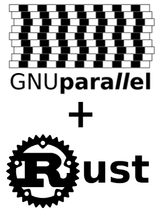

# Task Executor in Rust

## Work Team

**Tutors      :** Olivier Richard

**Members     :** Yael PARA, Victor MALOD, Lucas CHALOYARD, Dorian BARET

**Département :** [INFO4 - Polytech Grenoble](https://www.polytech-grenoble.fr/menu-principal/formations/informatique-ex-ricm-/)

---
## Objective
It is inspired by the GNU parallel software to develop a command executor in parallel with the RUST language. The language is particularly interesting for its performance and the production of robust code.
RUST is a demanding language but recognized by experts.

## Technological constraints
- RUST: https://www.rust-lang.org/
- Tokio https://github.com/tokio-rs/tokio

## Work plan
- RUST learning:
    - read the following book: https://doc.rust-lang.org/book/
    - at the same time do the exercises: https://github.com/rust-lang/rustlings/
- install the language help tools to your editor: example vscode (Visual Studio Code)

## Tips and indications
do technological watch

## Others
- https://www.gnu.org/software/parallel/
- https://en.wikipedia.org/wiki/GNU_parallel
---
## Doc
### [Tracking Sheet](tracking-sheet.md)
### [Technological Watch](technological-watch.md)
### [Conventions](conventions.md)
### [Specification](specification.md)