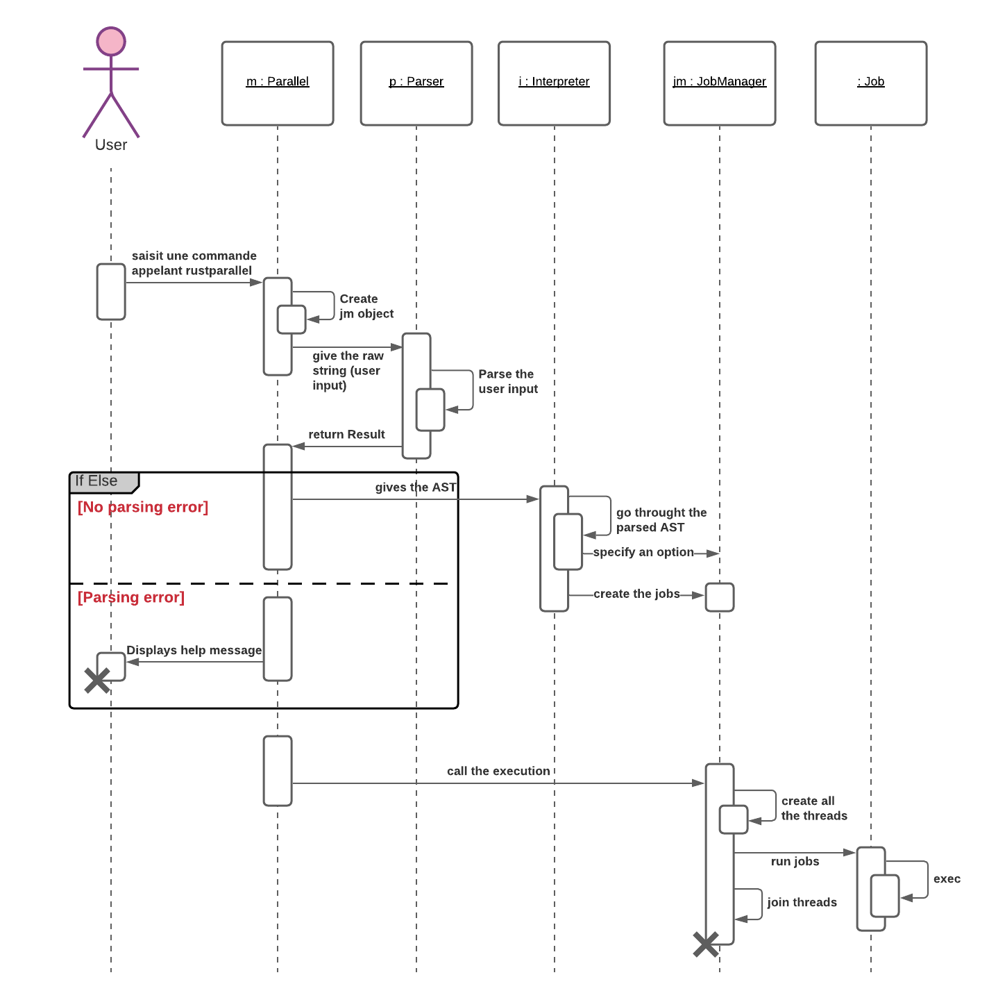
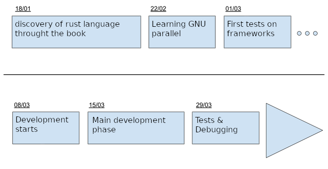

[Back](README.md)

# Specification


## Project's tree structure
```
src/
| --> parallel.rs
| --> remote/
        | --> server
        | --> client
| --> core/
		|--> job / jobmanager
		|--> parser / interpretor / grammar
```

## Design
### Detailed class diagram


- **Parallel** : Main class that will :
    - Create the JobManager.
    - Call the parser.
    - Give the results to the interpretor.
    - Start the execution.
- **Parser** : Will parse the user input and make sure it respect a given grammar.
- **Interpretor** : Will create all the jobs according to the given parse by the parser.
    - It will interpret every options and communicate them to the JM.
    - It will interpret the values after the `:::`s and build all possible combinations for the jobs.
    - It will then interpret targets like `{}` or `{1}` in the command and other stuff like quoted characters.
- **JobManager** : Manages all the jobs that will run.
- **Job** : Will contain all the needed information to execute one shell job.

### Sequence Diagram *(illustrates the above section)*



### Simplified grammar without left recursivity
```
*S → parallel options* commands* separators*

options → --dry-run 
        | --keep-order 
        | --pipe 
        | --jobs number 
        | --j number 
        | --help

commands → string arguments*

arguments → string 
          | 'string'
          | number*

separators → ::: input+

input → number       
      | string 
```

## Goals

### Gantt Digram



### Main goals
- parsing
- command execution
- parallel's features :
    + read standard input (using a `|` before calling parallel).
    + separator `:::` (can be called multiple times).
    + simple quotes to interpret special character.
    + targets like `{}`, `{1}`, `{2}`, ...
    + `--dry-run` option. 
    + `--keep-order` option.
    + `--pipe` option.
    + `--jobs` / `-j` : to choose the max number of working threads.

### Secondary goals
- remote execution using tokio.

