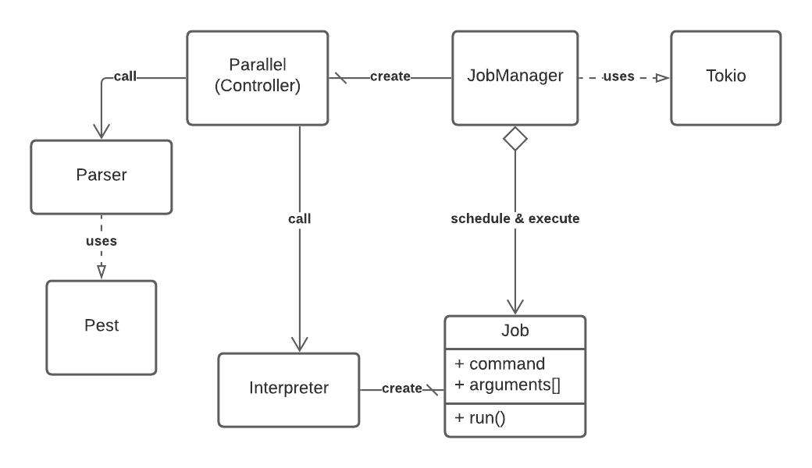

[Back](README.md)

# Specification

## note:
trouver des squelettes (Tokio)
tableau comparatif de veille 

## Structure/Arborescence du projet:
```
src/
| --> parallel.rs
| --> remote/
        | --> server/
        | --> client/
| --> core/
		|--> parser/
		|--> job/
```

## Diagramme de classe détails :
- **Parallel** : Classe principale, appellera le Parser afin de générer les objets Jobs, puis créera les JobManager permettant l’exécution
- **Parser** : Parse l’entrée du programme afin de créer des objets Jobs
- **JobManager** : Créer et ordonnance les JobExecutor, effectuera l’attribution des Jobs
- **JobExecutor** : Objet Thread?
- **Job** : Objets contenant les informations sur le Job qu’on va vouloir exécuter


## Choix d’implémentation :
=> Définir quelles fonctionnalités on souhaite implémenter

=> Énoncer les crates externes utilisées s’il y’en a

=> Structure du code : Binary crates, library crates, test, benchmark

=> Choix important : Décision d’implémenter la remote execution, choix d’une librairie au lieu d’une autre pour des optimisations conséquentes

- Choix de l'utilisation de la librairie (Mio ou Tokio) : Nous avons choisi d'utiliser Tokio afin de développer notre projet, car malheureusement Mio ne permet pas d'implémenter des applications possédant l'exécution de processus en parallèle, mais des applications qui gèrent des sources d'événements et qui permettent de créer une queue d'événements mis en attente. Nous avons donc choisit d'utiliser Tokio, qui semble être plus compliqué à appréhender, mais qui possède des fonctionnalités en lien avec notre projet.


## Enjeux technique : 
=> Parler des exigences (ENF ?) ??

=> 

## Objectifs 
### Objectifs finaux de Rust Parallel :
- parsing de commande avec arguments en objets Rust (voir diagramme de classe)
- exécution de commandes externes à parallel (comme echo par exemple)

- fonctionnalités parallel
    + lire l'entrée standard (utilisation d'une pipe avant parallel)
    + l'argument ":::" (peut être invoqué plusieurs fois)
    + simple guillemet pour interprétation de caractères spéciaux
    + l'argument {} et/ou {1}, {2}.
    + fonctionnalité --dry-run. 
    + fonctionnalité --keep-order.
    + fonctionnalité --pipe.
- multi-threader
    + --jobs / -j : choisir le nombre de thread

### Objectifs secondaires : 
- exécution à distance (via crates Tokio)

## Grammaire (avec récursivité)
```
*S → parallel options commands separators

options → ε
        | --dry-run options
        | --keep-order options
        | --pipe options
        | --jobs number options
        | --j number options
        | --help options

commands → string arguments

arguments → ε
        | string arguments
        | 'string' arguments 

separators → ε
        | ::: input separators

input → number nextInput        
        | string nextInput

nextInput → ε
        | input 
```

## Diagramme

### Gantt Digram

### Sequence Diagram

### Class Diagram


