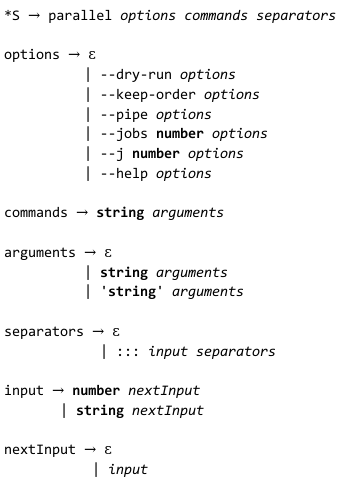

[Back](README.md)

# Tracking sheet

The project started on January 25, 2021

## Week 1 (25-01-2021) : 
- beginning of language learning
    + >[Rust book](https://doc.rust-lang.org/book/)

    + >[Rust by example](https://doc.rust-lang.org/stable/rust-by-example/index.html)
- setting up of a Rust language cheat sheet (on our private drive google)

## Week 2 (01-02-2021)
- installation of the rust environment
    + >[Toolchain rustup](https://www.rust-lang.org/tools/install)

    + >[VSCode Extension](https://marketplace.visualstudio.com/items?itemName=rust-lang.rust)
- learning Rust
- studying GNU parallel
    + >[2 Learn GNU Parallel in 15 minutes - GNU Parallel Book - Ole Tange
](books/GNU_Parallel_2018.pdf)
## Week 3 (08-02-2021)
- learning Rust
    - starting and finishing the [minigrep project](https://doc.rust-lang.org/book/ch12-00-an-io-project.html)
    - starting the [Web Server project](https://doc.rust-lang.org/book/ch20-00-final-project-a-web-server.html)
- [technological watch](technological-watch.md)
    - editing from our research on Rust since the beginning of the project
- initialization of project sources [`rust-parallel`](https://gricad-gitlab.univ-grenoble-alpes.fr/Projets-INFO4/20-21/14/rust-parallel) in the git repository

## Week 4 (15-02-2021 | holidays)
- ended the learning of Rust 
    + end server project
- technologie watch

## Week 5 (22-02-2021)
- study of GNU parallel
- wrote a first draw of our grammar

- a little training in Rust: creating an [input system in console](https://gricad-gitlab.univ-grenoble-alpes.fr/Projets-INFO4/20-21/14/rust-parallel/-/tree/entrycmd) mode like GNU parallel

## Week 6 (01-03-2021)
- wrote our [specifications](specification.md)
    + Project tree structure
    + Main objectif
    + Digram
- looked for [another framework](technological-watch.md##Asynchronous-framework) than Tokio
- writing of some code samples using Tokio
>the research was conclusive

> :warning: Now, these researches have been merge on master to really start the project

## Week 7 (08-03-2021)
- [mid-term presentation](soutenance-mi_parcours.pdf)
- definition of the features to be implemented 
    + client/server
    + grammare
        - search for a crate to parse a command line
        - first tests on the different crates
    + execution flow : manage the options, selected for our project, in the execution flow
    + interpretation of an AST (Abstract Syntax Tree)

## Week 8 (15-03-2021)
- execution flow : set up thread worker
    + set up dry_run : it works
    + set up keep_order : it works
    + retrieves stdout asynchronously using a "multi-producer, single-consumer" approach 
- grammar parsing : branch **pest-main**
    + first steps with pest crate
    + implementing our grammar in .pest format
    + first parsing tests with simple input from a file
- client/server : branch **remoteExec-code**
    + code refactoring in a Channel mod
    + redesigning of Client/Server in order for them to use Channel
    + implementation of a test (using of predefined server address)
        - Client : cargo run -- -c [msgToSend]"
        - Server : cargo run -- -s"
- interpretor : branch **interpretor**
    + new version of the function interpret in order to create jobs
    + modification of Job class without arguments   
